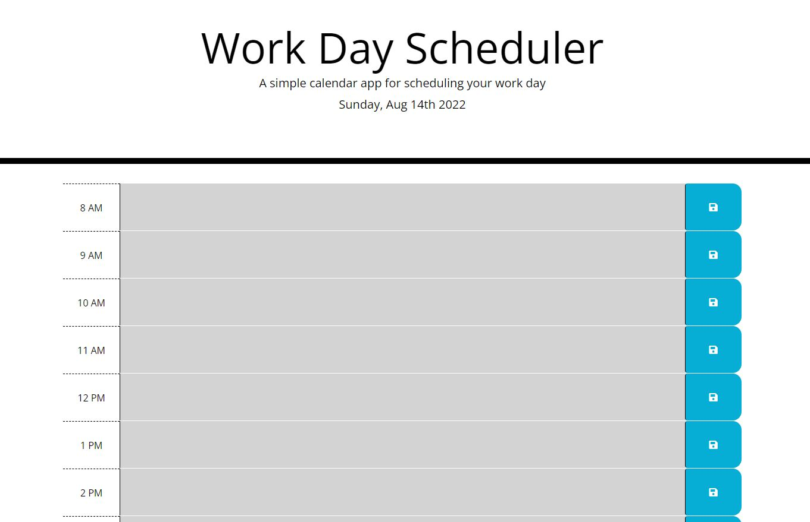

# WORK DAY SCHEDULER

## 1. Description
Simple calendar application that allows the user to save events for each hour of the day. This application was built using HTML, CSS and JavaScript (jQuery)

[DIRECT LINK](https://cbushehry.github.io/work-day-scheduler/)

## 2. Features
 * Calendar display for todays work (8am - 5pm)
 * Current day and date is displayed on the top of the page and automatically updated everyday
 * Time blocks are color coded to easily keep track of the task the user is currently working on
 * Time blocks contain input field and save button where users can store their schedule
 * When user clicks save, the time block will save to their local storage
 * Desktop and Mobile copmatible

 

## 3. Credits / Contact Info
This application was created by Cameron Bushehry

  
  