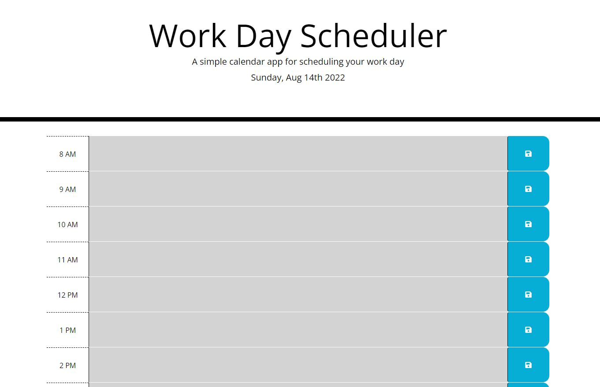

# WORK DAY SCHEDULER

## 1. Description
Simple calendar application that allows the user to save events for each hour of the work day. Built with HTML, CSS, and vanilla JavaScript — no jQuery or external JS dependencies.

[DIRECT LINK](https://cbushehry.github.io/work-day-scheduler/)

## 2. Features
 * Calendar display for today's work day (8 AM - 5 PM)
 * Current day and date displayed at the top of the page using the native `Intl` API
 * Time blocks are color coded to indicate past (gray), present (red), and future (green) hours
 * Colors update automatically every minute without requiring a page refresh
 * Each time block has an input field and save button to store notes in localStorage
 * Saved notes persist across page refreshes and browser sessions
 * Desktop and mobile compatible

 

## 3. Tech Stack
 * HTML5, CSS3
 * Vanilla JavaScript (no jQuery, no Moment.js)
 * Bootstrap 5.3
 * Font Awesome 5.8
 * Browser localStorage

## 4. Credits / Contact Info
Created by Cameron Bushehry

  
  
